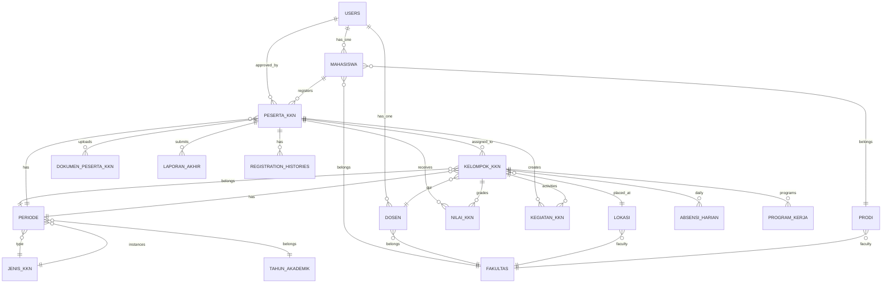

# Database Relationship Diagram - KKN UIN Saizu

## Core Entities



## Detailed Relationships

### 1. User & Identity Chain
```
users (id, name, email, phone, avatar, fakultas_id)
  ↑
  ├── mahasiswa (user_id, nim, nama, fakultas_id, prodi_id, sks_completed, gpa, status_bta_ppi)
  │   └── prodi (fakultas_id)
  │
  ├── dosen (user_id, nip, nama, fakultas_id)
  │   └── fakultas
  │
  └── peserta_kkn (approved_by → users.id)
```

### 2. Registration Flow
```
mahasiswa
  ↓ (registrations)
peserta_kkn (mahasiswa_id, periode_id, status, Kelompok_id)
  │
  ├── periode (jenis_kkn_id, academic_year_id)
  │   ├── jenis_kkn (code, name, min_sks, min_gpa)
  │   └── tahun_akademik
  │
  ├── kelompok_kkn (periode_id, location_id, dpl_id)
  │   ├── lokasi (village_name, district_name, regency_name)
  │   └── dosen (DPL)
  │
  └── registration_histories (peserta_kkn_id, from/to_periode_id, from/to_kelompok_id)
```

### 3. Activity Tracking
```
peserta_kkn
  │
  ├── kegiatan_kkn (mahasiswa_id, kelompok_id) - Daily logbook
  │
  ├── absensi_harian (mahasiswa_id, kelompok_id)
  │   └── izin_meninggalkan (izin_id)
  │
  └── nilai_kkn (user_id, kelompok_id)
      └── sertifikat_kkn
```

### 4. Reports & Documents
```
peserta_kkn
  │
  ├── dokumen_peserta_kkn (peserta_kkn_id)
  │
  ├── laporan_akhir (mahasiswa_id, kelompok_id)
  │
  └── rekapitulasi_kegiatan (kelompok_id, program_kerja_id)
      └── program_kerja (kelompok_id, title, kategori)
```

## Foreign Key Summary

### Primary Tables (Required for KKN)
| Table | FK References | Required For |
|-------|---------------|--------------|
| users | fakultas_id | Login, profile |
| mahasiswa | user_id, fakultas_id, prodi_id | Registration |
| periode | academic_year_id, jenis_kkn_id | Registration period |
| jenis_kkn | - | KKN type config |
| peserta_kkn | mahasiswa_id, periode_id, kelompok_id | Student registration |
| kelompok_kkn | periode_id, location_id, dpl_id | Student placement |
| dosen | user_id, fakultas_id | DPL assignment |
| lokasi | fakultas_id | Village/location |

### Activity Tables
| Table | FK References | Purpose |
|-------|---------------|---------|
| kegiatan_kkn | mahasiswa_id, kelompok_id | Daily reports |
| absensi_harian | mahasiswa_id, kelompok_id, izin_id | Attendance |
| izin_meninggalkan | mahasiswa_id, kelompok_id | Permission requests |
| program_kerja | kelompok_id, approved_by | Work programs |

### Evaluation Tables
| Table | FK References | Purpose |
|-------|---------------|---------|
| nilai_kkn | user_id, kelompok_id, admin/dpl_graded_by | Grades |
| evaluasi | mahasiswa_id, kelompok_id, evaluator_id | DPL evaluation |
| laporan_akhir | mahasiswa_id, kelompok_id, reviewed_by | Final report |
| Sertifikat_kkn | user_id, kelompok_id, nilai_kkn_id | Certificate |

## Status Flow

### PesertaKkn Status
```
registered → pending → approved → placed → ongoing → completed
    ↓          ↓           ↓         ↓        ↓
  Submit    Admin cek  Kelompok 执行的   Yudisium
           (LPPM)     dibuat
```

## Key Constraints

1. **Unique Constraints:**
   - `users.email` - Login unique
   - `users.username` - Login unique  
   - `mahasiswa.nim` - Student ID unique
   - `dosen.nip` - Lecturer ID unique
   - `peserta_kkn(mahasiswa_id, periode_id)` - One registration per student per period
   - `kelompok_kkn(periode_id, location_id)` - One group per location

2. **Check Constraints:**
   - `jenis_kkn.registration_mode` - IN (open, selective, proposal_based)
   - `jenis_kkn.placement_mode` - IN (automatic_after_approval, manual_admin, host_defined, proposal_defined)
   - `peserta_kkn.status` - IN (registered, pending, approved, rejected, completed, cancelled)

3. **Not Null Constraints:**
   - `periode.academic_year_id` - Required
   - `periode.name` - Required
   - `mahasiswa.nim` - Required
   - `kelompok_kkn.periode_id` - Required
   - `peserta_kkn.mahasiswa_id` - Required
   - `peserta_kkn.periode_id` - Required